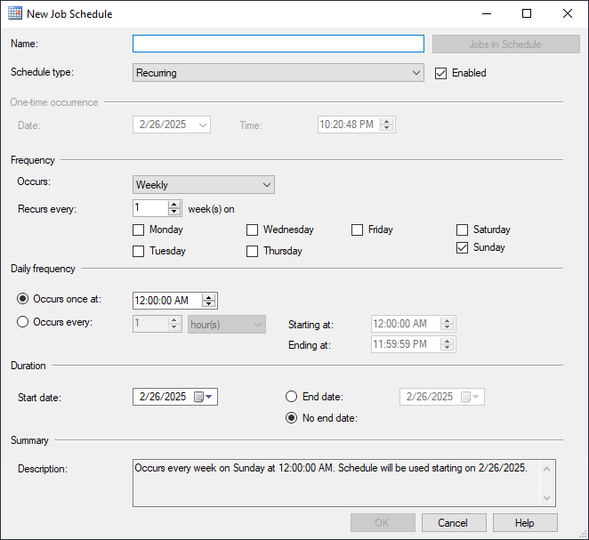
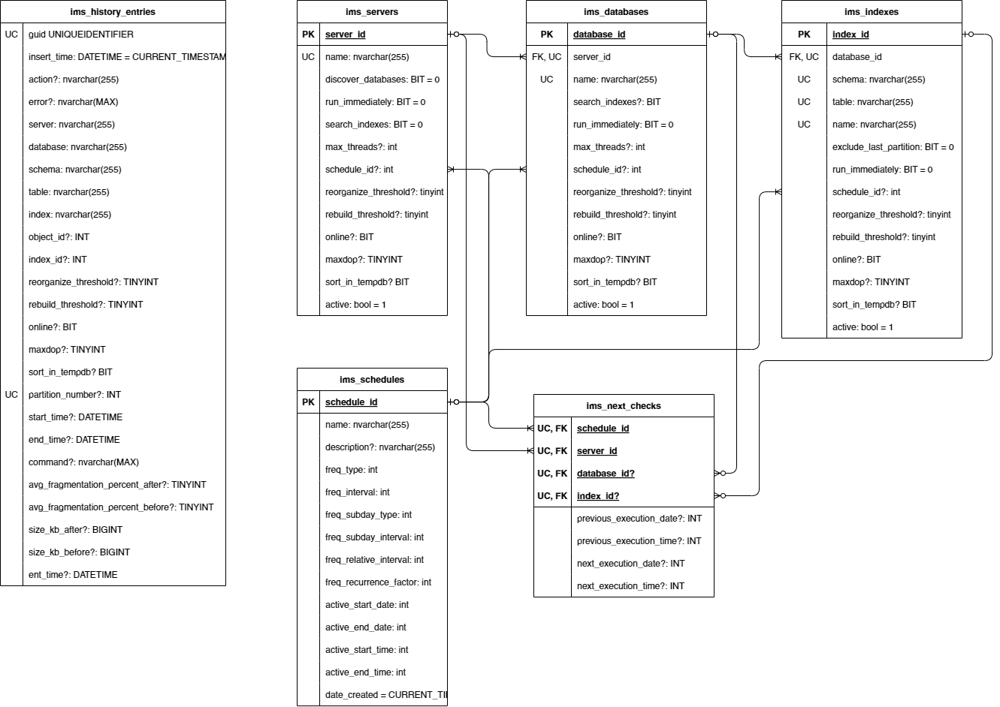

# SQL Server Index Maintenance System

A robust, configurable solution for automating SQL Server index maintenance operations across multiple servers and databases.

## Overview

The SQL Server Index Maintenance System automates the process of maintaining database indexes by scheduling and executing reorganize and rebuild operations based on configurable thresholds. It monitors index fragmentation levels and performs maintenance tasks according to defined schedules, priorities, and resource constraints.

## Features

- Multi-server and multi-database support
- Configurable maintenance schedules
- Automated index reorganization and rebuilding
- Database and index discovery capabilities
- Concurrent operation management with thread limits
- Detailed logging of all operations
- Support for running as a Windows service or console application

## Requirements

- .NET 8.0 Runtime
- SQL Server instance for the central management database

## Installation

1. Download the latest release binaries
2. Configure the `appsettings.json` file with your environment details
3. Run the application as a console app or install it as a Windows service

### Console Mode

```cmd
SqlServerIndexMaintenanceSystem.exe
```

### Windows Service Installation

```cmd
sc.exe create "IndexMaintenanceService" binpath="C:\Program Files\IndexMaintenanceSystem\SqlServerIndexMaintenanceSystem.exe"
net start IndexMaintenanceService
```

## Configuration

### appsettings.json

```json
{
    "ConnectionStrings": {
        "MainDatabase": "Server=localhost;Database=IndexMaintenanceSystem;Trusted_Connection=true;TrustServerCertificate=true;Application Name=IndexMaintenanceSystem;",
        "ClientDatabaseTemplate": "Server={0};Database={1};Trusted_Connection=true;TrustServerCertificate=true;Application Name=IndexMaintenanceSystem;"
    },
    "ExecutionIntervalSeconds": 30
}
```

- `MainDatabase`: Connection string for the management database
- `ClientDatabaseTemplate`: Template for connecting to target databases ({0} = server name, {1} = database name)
- `ExecutionIntervalSeconds`: How often the system checks for maintenance tasks to perform

## Credentials Management

The system supports encrypted credential storage for connecting to SQL Server instances that require specific authentication. This eliminates the need to store sensitive credentials in plain text configuration files.

### Generating Credentials

Use the `CredentialsManager.exe` CLI tool provided alongside with the service to generate encrypted credential files:

```cmd
CredentialsManager.exe add "ServerName" "sa" "mySecurePassword123"
```

This command creates an encrypted `credentials.bin` file in the application directory containing the specified connection credentials.

You can read more about this tool [here](./CredentialsManager/README.md).

### Automatic Credential Detection

When the service runs, it automatically checks for and loads credentials from the configured file. If credentials exist for a server, they take precedence over the `Trusted_Connection=True` setting of connection string template from `appsettings.json`.

### Custom Credentials File Location

You can specify a different credentials file by modifying the `CredentialsFilePath` setting in `appsettings.json`:

```json
{
    "CredentialsFilePath": "C:\\\\full\\path\\to\\your\\custom-credentials.bin"
}
```

The credentials file is encrypted using `Windows DPAPI` and can only be decrypted on the machine it was created on.

## Setting things up

Below are the essential configuration topics you'll need to understand to effectively utilize the Index Maintenance System:

- [Minimal Configuration](#minimal-configuration)
- [Server Configuration](#server-configuration)
- [Database Configuration](#database-configuration)
- [Index Configuration](#index-configuration)
    - [Special Index Settings](#special-index-settings)
- [Hierarchical Configuration Settings](#hierarchical-configuration-settings)
    - [Inheritance Precedence](#inheritance-precedence)
- [Automated Discovery](#automated-discovery)
- [Scheduling](#scheduling)
- [run_immediately Column](#run_immediately-column)
- [active Column](#active-column)
- [Parallelization Settings](#parallelization-settings)

To begin using the Index Maintenance System, you need to configure the management database with your server, database, and index information.

### Minimal Configuration

For quick deployment with automatic discovery, configure only your server with the following command:

```sql
INSERT INTO ims_servers (name, discover_databases, search_indexes, run_immediately)
VALUES ('YourServerName', 1, 1, 1);
```

This minimal configuration initiates the following workflow:

- The system performs a one-time database discovery operation, populating the `ims_databases` table
- All discovered databases explicitly inherit the `run_immediately` flag
- The server's `run_immediately` flag is automatically reset after discovery completes
- During the next execution cycle, the system identifies and defragments all indexes in the discovered databases
- All maintenance operations are recorded in the `ims_history_entries` table
- The `run_immediately` flag is automatically reset for each database after its index maintenance completes

This approach provides immediate index maintenance across your entire server with minimal configuration overhead.

Below are detailed configuration instructions that offer fine-grained control over the system. While these options require more setup time, they enable comprehensive customization of your index maintenance workflows.

### Server Configuration

Start by adding entries to the `ims_servers` table:

```sql
INSERT INTO ims_servers (name)
VALUES ('YourServerName');
```

The `name` parameter is required and will be interpolated into the connection string template from `appsettings.json`. Other optional parameters follow the hierarchical configuration model described below.

### Database Configuration

Next, specify which databases to maintain:

```sql
DECLARE @server_id INT = SCOPE_IDENTITY();

INSERT INTO ims_databases (server_id, [name])
VALUES (@server_id, 'YourDatabaseName');
```

Only the `name` parameter is required. This will be used in the connection string template when connecting to the database. Other optional parameters follow the hierarchical configuration model described below.

### Index Configuration

Finally, configure specific indexes to maintain:

```sql
DECLARE @database_id INT = SCOPE_IDENTITY();

INSERT INTO ims_indexes (database_id, [schema], [table], [name])
VALUES (@database_id, 'dbo', 'YourTableName', 'IX_YourIndexName');
```

Required fields:
- `schema`: The schema containing the table (typically 'dbo')
- `table`: The name of the table containing the index
- `name`: The full name of the index

### Hierarchical Configuration Settings

The system implements a configuration inheritance model across server, database, and index levels. This allows for defining settings at a higher level while enabling specific overrides where needed.

The following configuration settings are available at all three levels (`ims_servers`, `ims_databases`, and `ims_indexes`):

| Setting | Description |
|---------|-------------|
| `reorganize_threshold` | Fragmentation percentage that triggers reorganize operations |
| `rebuild_threshold` | Fragmentation percentage that triggers rebuild operations |
| `schedule_id` | Which maintenance schedule to follow |
| `run_immediately` | Whether to run maintenance as soon as possible |
| `online` | Whether to perform online index operations |
| `maxdop` | Maximum degree of parallelism for index operations |
| `sort_in_tempdb` | Whether to use tempdb for sorting during index operations |
| `index_min_size_kb` | Minimum size threshold for indexes in kilobytes. Indexes smaller than this value are skipped. |
| `exclude_last_partition` | Whether to exclude the last partition from maintenance operations |
| `active` | Whether the entity is actively monitored |

#### Inheritance Precedence

Settings follow this precedence order (highest priority first):

1. **Index Level** (`ims_indexes`) - Most specific, overrides all others
2. **Database Level** (`ims_databases`) - Applied if not specified at index level
3. **Server Level** (`ims_servers`) - Applied if not specified at lower levels

This approach allows you to define default settings at the server level, customize them for specific databases, and further refine them for individual indexes as needed.

Some settings have special behavior or exceptions, which are detailed in the sections below.

#### Special Index Settings

The `exclude_last_partition` setting (when set to 1) prevents the system from maintaining the last partition of partitioned tables. This is useful for tables where the most recent partition receives high write activity, allowing maintenance to occur on older partitions without affecting current operations.

This setting is available at all three configuration levels (server, database, and index) and follows the standard inheritance hierarchy. You can set a default policy at the server level, override it for specific databases, and further customize it for individual indexes as needed.

### Automated Discovery

The system can automatically discover and configure databases and indexes:

**Discovery Levels:**
- **Server Level**: When `discover_databases = 1`, the system finds all databases on the server and adds them to `ims_databases`.
- **Database Level**: When `ims_databases.search_indexes = 1` or `ims_databases.search_indexes is null and ims_servers.search_indexes = 1`, the system searches for all indexes when processing the database.

**Configuration:**
1. Enable discovery by setting the appropriate flag (`discover_databases` or `search_indexes`)
2. Set either `schedule_id` or `run_immediately = 1` to trigger the discovery process

Database discovery runs only once and then automatically disables itself. All discovered databases inherit configuration settings from their parent server according to the hierarchy rules.

### Scheduling

The Index Maintenance System uses a scheduling engine modeled after SQL Server Agent schedules. All maintenance operations run according to defined schedules in the `ims_schedules` table.

Here is an example of the simplest one-time right away schedule:

```sql
INSERT INTO dbo.ims_schedules (
    [name], freq_type, freq_interval, freq_subday_type,
    freq_subday_interval, freq_relative_interval, freq_recurrence_factor,
    active_start_date, active_end_date, active_start_time, active_end_time
)
VALUES ('OneTime test schedule', 1, 0, 0, 0, 0, 0, 0, 0, 0, 0);
```

You can find more examples of schedules in [ims_schedules_examples.sql](./SqlServerIndexMaintenanceSystem/Scripts/Helpers/ims_schedules_examples.sql).


The most efficient way to create schedules:

1. Use SQL Server Management Studio to create a SQL Agent schedule with your desired pattern
2. Use the provided stored procedure [sp_ims_copy_from_sysschedules](./SqlServerIndexMaintenanceSystem/Scripts/Helpers/sp_ims_copy_from_sysschedules.sql) to copy this schedule into the maintenance system



Schedules can be assigned at the server, database, or individual index level according to the hierarchical configuration model.

### `run_immediately` Column

The `run_immediately` flag provides a way to execute maintenance tasks instantly without waiting for scheduled times. This feature is particularly useful for testing or addressing urgent fragmentation issues.

When set to `1` (enabled):
- The system will process the affected indexes at the next check cycle
- Regular schedules remain active and will still execute at their defined times
- The system prevents duplicate operations (the same database or index will never be processed simultaneously by multiple tasks)

After index maintenance completes, the system automatically resets the `run_immediately` flag to `0`. This behavior differs from other settings in the system:

- When a server has `run_immediately = 1`, the system automatically propagates this value to any child databases with a `null` setting
- Once a database's maintenance completes, its `run_immediately` flag is automatically reset to `null`

### `active` Column

The `active` flag controls whether an entity participates in maintenance operations:

- When set to `0` (inactive), the entity and all its child entities are excluded from processing
- When set to `1` (active), the entity is eligible for maintenance according to its schedule

This flag follows the hierarchical inheritance model:
- Inactive server → All its databases and indexes are skipped
- Inactive database → All its indexes are skipped regardless of their individual settings
- Inactive index → Only that specific index is excluded

Use this flag to temporarily exclude maintenance targets.

### Parallelization Settings

The `max_threads` parameter controls concurrent operations at both server and database levels:

- **Server level**: Limits the total number of parallel tasks for the entire server
- **Database level**: Restricts concurrent connections to a specific database
- When both are specified, the lower value takes precedence
The system uses the following default threading behavior:

- Default value of `max_threads` is 1, which means operations run serially (one after another)
- Setting `max_threads` to 0 removes thread limits, allowing the system to process as many parallel operations as resources permit
- Values greater than 1 specify the exact number of concurrent operations allowed

This setting is not available at the index level since each index defragmentation operation runs in its own dedicated connection.

Managing thread limits helps balance system performance by preventing resource exhaustion while still allowing sufficient parallelism for efficient maintenance operations.

### Transaction Log Size check

`TLogSizeFactor` parameter in `ims_servers` determines which indexes are processed based on their size relative to the transaction log (tlog) size.

The setting works as follows:
- When enabled (>0), indexes are processed only if (index_size * TransactionLogSizeFactor) ≤ tlog_size
- When disabled (<= 0 or NULL), all indexes are processed regardless of size

Examples with tlog_size = 10GB:
- TransactionLogSizeFactor = 1.0: Indices ≤ 10GB are processed, larger ones are skipped
- TransactionLogSizeFactor = 2.0: Indices ≤ 5GB are processed (must be half the tlog size or smaller)
- TransactionLogSizeFactor = 0.5: Indices ≤ 20GB are processed (can be up to twice the tlog size)

Higher values are more restrictive (fewer indexes processed), lower values are more permissive.

### AlwaysOn check

When the database is configured to be primary replica of the `AlwaysOn Availability Group` in `Synchronous-commit` mode, the defragmentation can cause issues.

In order to prevent that, there is a mechanism of switching the mode from `synchronous-commit` to `asynchronous-commit` for the time of indexes defragmentation. After the completion, the mode is reverted to it's initial state.

This behavior is controlled by `enable_always_on_check` setting of the `ims_servers` and `ims_databases` tables.

## History

The system maintains detailed historical records of all index maintenance operations in the `ims_history_entries` table. This comprehensive audit trail includes:

- Correlation GUIDs that link to file-based log entries
- Index fragmentation measurements (before and after maintenance)
- Operation timestamps (start and end times)
- Exact SQL commands executed during maintenance
- Any errors encountered during processing
- Complete configuration snapshots used for each operation

This historical data allows administrators to analyze maintenance patterns, verify successful operations, troubleshoot issues, and optimize future maintenance strategies based on actual performance data.

### Action

Each history entry contains an `action` value, which describes whether rebuild or reorg was performed and why (if not).

It can have one of the following values:
- `REBUILD`: the rebuild command was initiated on the index;
- `REORGANIZE`: the reorganize command was initiated on the index;
- `SKIPPED_*`: the index was skipped due to some reason:
    - `SKIPPED_NOT_NEEDED`: The index fragmentation level is below the configured thresholds, so no maintenance action is required
    - `SKIPPED_INACTIVE`: The index has been marked as inactive in the configuration and is excluded from maintenance operations
    - `SKIPPED_INDEX_MIN_SIZE`: The index size is below the configured minimum size threshold (set by `index_min_size_kb`)
    - `SKIPPED_TLOG_SIZE`: The index size exceeds the safe threshold relative to the transaction log size according to `tlog_size_factor` configuration
    - `SKIPPED_TLOG_DISK_SAFETY_PERCENT`: The potential transaction log growth from maintaining this index would exceed the configured safety percentage of available disk space
    - `SKIPPED_DISK_MIN_REMAINING_SPACE`: The potential transaction log growth would leave less than the configured minimum required free space on disk
    - `SKIPPED_RUN_IMMEDIATELY_DISABLED`: The index has the `run_immediately` flag explicitly set to false
    - `SKIPPED_OWN_SCHEDULE`: The index has its own maintenance schedule defined, different from the database-level schedule currently running

## Database Schema

The management database specified in the `MainDatabase` connection string is automatically created if it doesn't already exist on the server. This eliminates the need for manual database creation before using the system.

The system automatically creates and maintains the following tables in the management database:

### [dbo].[ims_servers]
Stores configuration for servers to be monitored including thread limits for concurrent operations.

### [dbo].[ims_databases]
Configures the databases to monitor on each server with options like thread limits and whether to check all indexes.

### [dbo].[ims_indexes]
Stores index-specific configuration and maintenance history.

### [dbo].[ims_schedules]
Defines maintenance schedules and execution parameters.

### [dbo].[ims_next_checks]
Manages upcoming maintenance operations.

### [dbo].[ims_history_entries]
Stores detailed logs of index maintenance operations, including executed SQL commands, fragmentation measurements before and after operations, and configuration settings used during maintenance.

The following entity relationship diagram illustrates the structure and relationships between all system tables:


## Logging

The system logs all operations to both console and files in the `logs` directory. Each log entry includes a correlation GUID for tracking related operations. Log entries can be correlated with their respective history entries in the `ims_history_entries` table by using this correlation ID, providing an integrated view of both file-based logs and database-stored operation history.

The log level can be set in appsettings.json:
```Json
{
    "Logging": {
        "LogLevel": {
            "Default": "Information",
            ...
        },
        "File": {
            ...
        },
        "Console": {
            ...
        }
    }
}
```

The log level can have one of the following values:
- `Error`: Critical issues that cause application failure or incorrect functionality, requiring immediate attention.
- `Warning`: Potentially harmful situations that don't cause failure but indicate possible problems.
- `Information`: General operational messages confirming normal application functioning and significant events.
- `Debug`: Detailed diagnostic information useful during development, including variable values and execution flow.
- `Trace`: The most verbose level capturing step-by-step program execution details, used for pinpointing exact code paths.

Log level can be overwritten for the particular output, e.g. for `Console`:  
```Json
{
    "Logging": {
        "LogLevel": {
            "Default": "Information",
            ...
        },
        "File": {
            ...
        },
        "Console": {
            ...
            "LogLevel": {
                "Default": "Warning"
            }
        }
    }
}
```